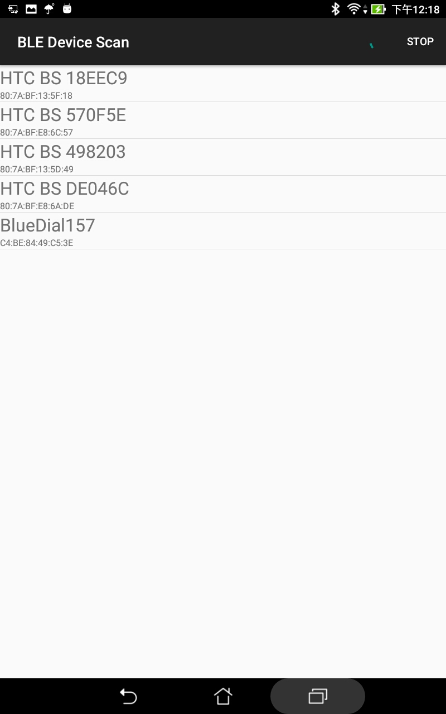
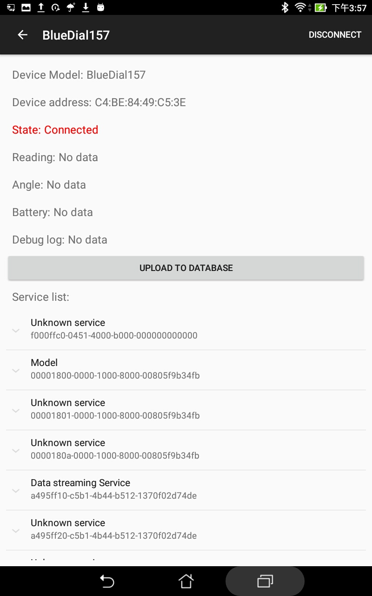
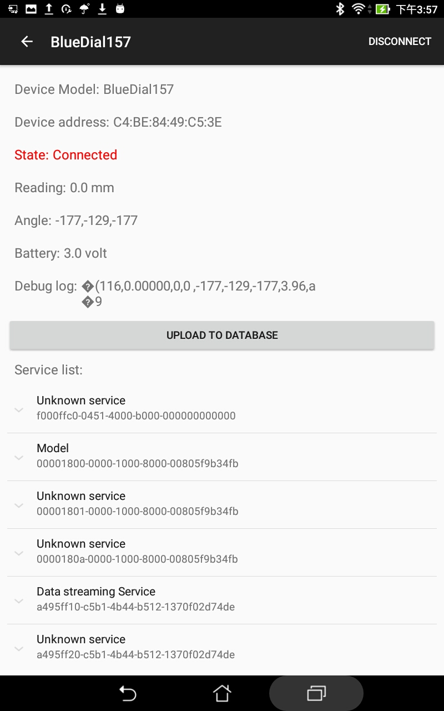

Android BleutoothLE Dail Reader 
===================================

This project is based on the Android BluetoothLE Sample

Introduction
------------

This application will allow you to access the BlueDial from Motionics and upload the data to the database. 

Requirement
--------------
- Android Studio 
- Android SDK 24
- Android Build Tools v24.0.1
- Android Support Repository

Screenshots
--------------

