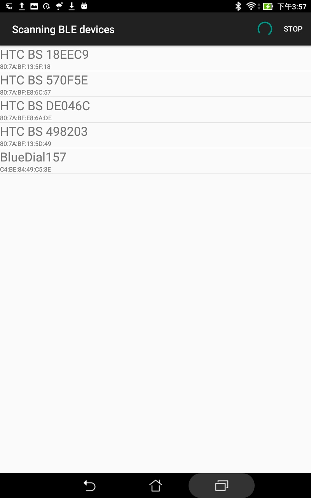

Android BleutoothLE Dail Reader 
===================================

This project is based on the Android BluetoothLE Sample Code. 

Introduction
------------

This application will allow you to access the BlueDial and WiMer from Motionics and upload the data to the database. 
Features:
- BluetoothLE Scan
- BluetoothLE GATT service
- BluetoothLE Notification
- BluetoothLE Read/Write service
- Http Post

Requirement
--------------
- Android Studio 
- Android SDK 24
- Android Build Tools v24.0.1
- Android Support Repository

Server Side:
- linux distrubation or others OS which supports apache php server
- php version > 5 

Screenshots
--------------
1. Scan for BLE devices 

2. Connet to GATT server, waiting for notification

3. Start data streaming

4. Upload data to database

